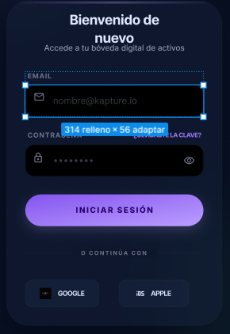
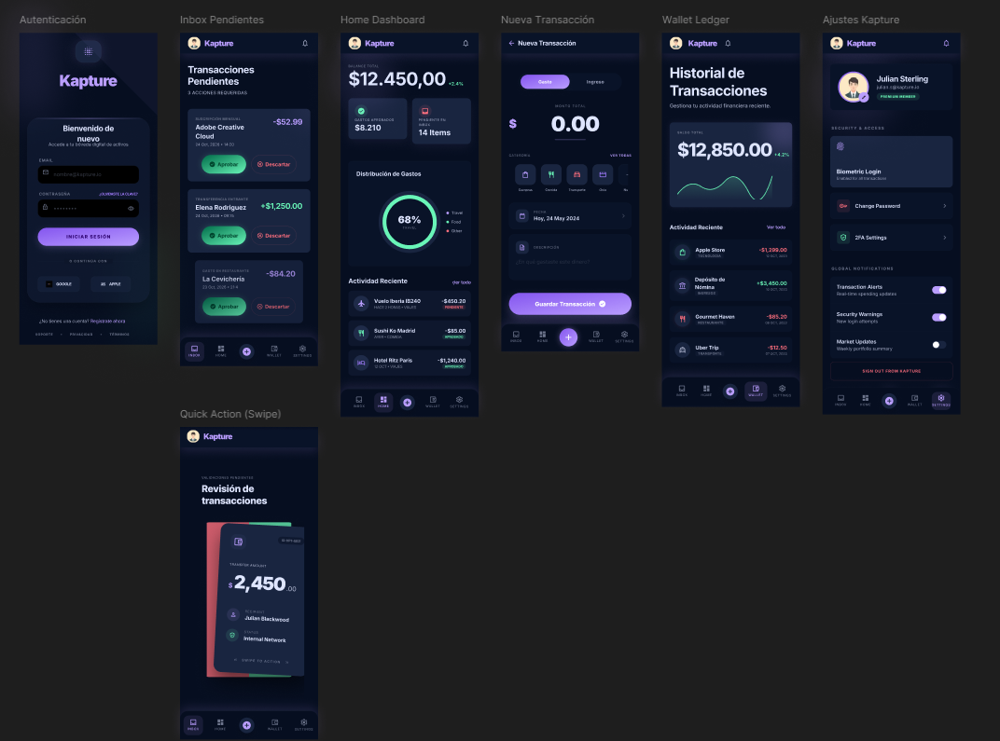

# 🎨 Kapture – UI Kit & Design System

**Materia:** Diseño de Interfaces  
**Integrantes:**
- **Thomas** – Diseño de Componentes (UI Kit) y Teoría  
- **Duvan** – Interacción, Animación y Prototipado  
- **Alejandro** – Conceptualización Visual y Gestión de Entrega (Project Manager)

---

## 📋 Introducción

Este documento consolida el sistema de diseño de **Kapture**, una aplicación de gestión financiera personal. El UI Kit define los fundamentos visuales y componentes reutilizables que garantizan consistencia en toda la interfaz.

---

## 🎨 1. Código Cromático

La paleta de colores de Kapture sigue una estética oscura con acentos neón, orientada a transmitir modernidad, tecnología y claridad financiera.

| Token | Valor | Descripción |
|-------|-------|-------------|
| `color-bg-base` | `#0F172A` | Slate 900 – Azul noche muy oscuro para el fondo general de la aplicación. |
| `color-surface` | `#1E293B` | Slate 800 – Fondo de tarjetas y contenedores principales. |
| `color-neon-primary` | `#8B5CF6` | Violeta eléctrico – Color principal de marca y elementos de enfoque. |
| `color-neon-success` | `#10B981` | Menta neón – Usado para acciones positivas como **Aprobar**. |
| `color-neon-danger` | `#F43F5E` | Rosa/Rojo neón – Usado para acciones negativas como **Descartar**. |
| `color-text-main` | `#F8FAFC` | Blanco hueso – Color principal del texto para máxima legibilidad. |
| `color-text-muted` | `#94A3B8` | Gris claro – Usado para fechas, descripciones o información secundaria. |

**Evidencia visual – Paleta aplicada en el Home:**

---

## 🔤 2. Variables Tipográficas

Kapture utiliza **Inter** como fuente principal del sistema, seleccionada por su legibilidad en pantallas digitales y su estética técnica y moderna.

| Token | Valor | Uso |
|-------|-------|-----|
| `font-family-sans` | `'Inter', sans-serif` | Fuente principal del sistema. Limpia, técnica y altamente legible en pantallas. |
| `font-weight-regular` | `400` | Peso estándar para texto normal. |
| `font-weight-bold` | `600` | Usado para **montos de dinero y títulos importantes**. |

**Evidencia visual – Tipografía aplicada en la sección Wallet:**

---

## 🔘 3. Botones

Los botones principales de Kapture están diseñados para comunicar de forma inmediata la intención de cada acción financiera, usando el código cromático neón como apoyo semántico.

- **Aprobar transacción** – Usa `color-neon-success` (`#10B981`)
- **Descartar transacción** – Usa `color-neon-danger` (`#F43F5E`)

**Evidencia visual:**

---

## 📝 4. Inputs y Labels

Los campos de entrada se evidencian en la pantalla de inicio de sesión, donde el usuario ingresa sus credenciales. El diseño prioriza la legibilidad sobre fondo oscuro.

**Evidencia visual – Inputs en pantalla de Login:**

---

## 🃏 5. Tarjetas (Cards)

Las tarjetas son el componente estructural principal de Kapture. Prácticamente toda la información de la aplicación se presenta dentro de cards, usando `color-surface` (`#1E293B`) como fondo de contenedor.

**Evidencia visual – Cards a lo largo de la aplicación:**

---

## 🧭 6. Barra de Navegación

La barra de navegación inferior contiene los accesos principales de la aplicación, cada uno acompañado de su ícono correspondiente.

| Ítem | Descripción |
|------|-------------|
| 🏠 Home | Pantalla principal |
| 📥 Inbox | Notificaciones y actividad |
| ➕ | Acción rápida (botón central) |
| 👛 Wallet | Gestión financiera |
| ⚙️ Settings | Configuración de la cuenta |

**Evidencia visual:**

---

## 🖼️ 7. Estados de Íconos

Los íconos de Kapture están categorizados por tipo de transacción, permitiendo al usuario identificar visualmente el origen o destino de cada movimiento financiero.

| Ícono | Categoría |
|-------|-----------|
| 💻 | Tecnología |
| 💰 | Ingresos |
| 🍽️ | Restaurante |
| 🚌 | Transporte |

**Evidencia visual:**

---

---

